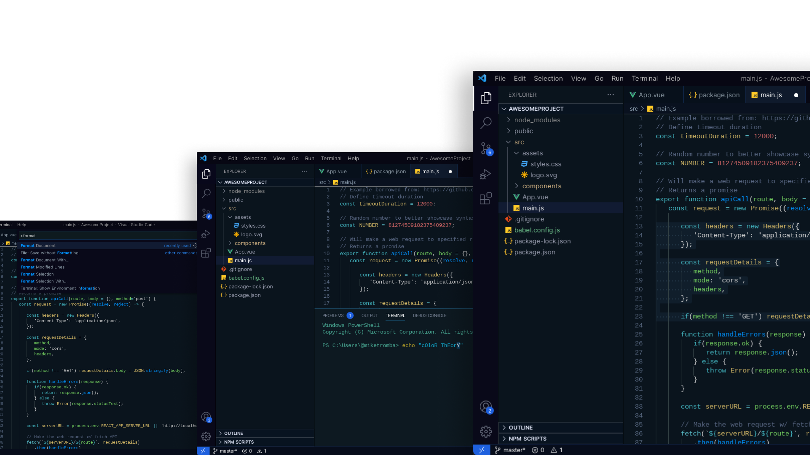

## A Modern & futuristic theme by Mr.kumar

Thanks for checking out my VS Code theme.

[Marketplace:](https://marketplace.visualstudio.com/items?itemName=Mrkumar.Eon-theme&ssr=false)

## Installation

1. Open the extensions sidebar on Visual Studio Code
1. Search for Significants theme
1. Click Install
1. Click Reload to reload your editor
1. Click on settings icon (bottom left) > Color Theme ＞ Significants theme
1. 🌟🌟🌟🌟🌟 Rate five-stars 😃
